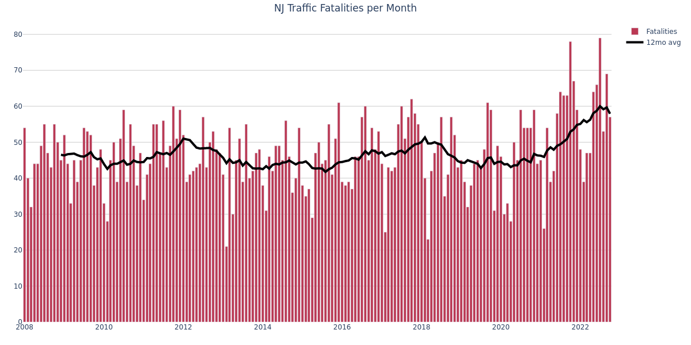
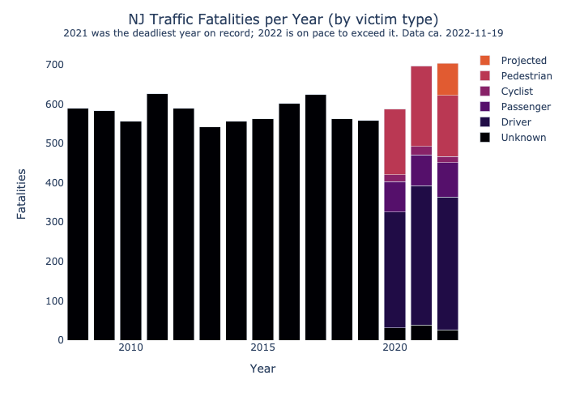
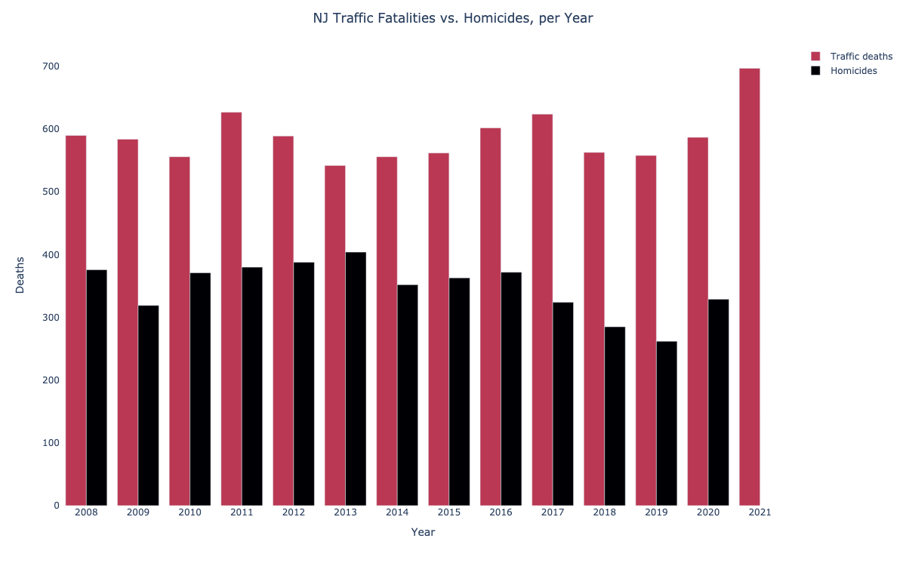
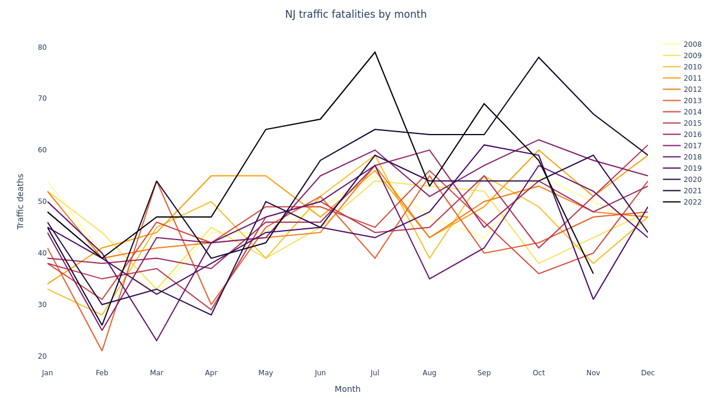
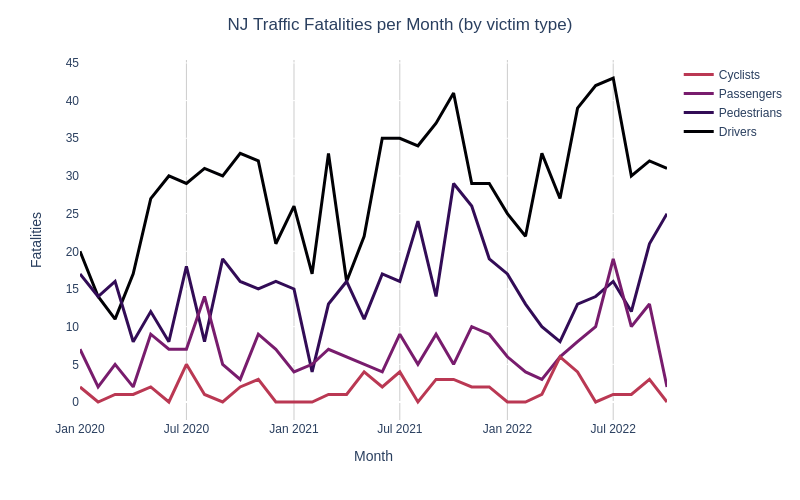
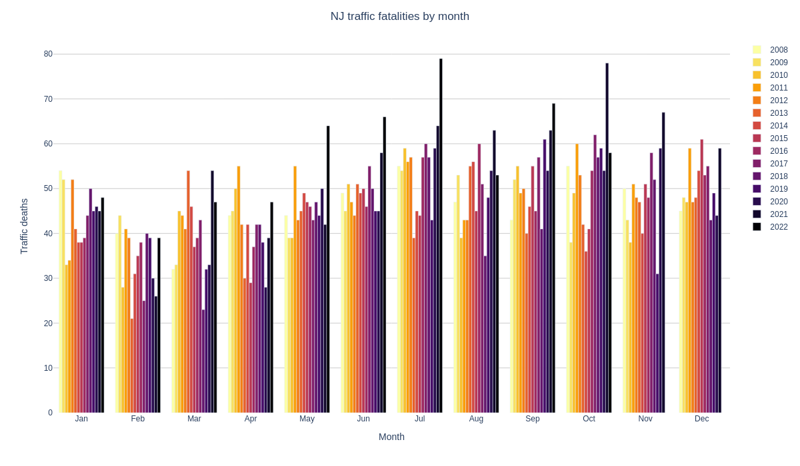

# NJ Traffic Violence Data
Analysis of NJ State Police traffic violence data (2008-present): https://nj.gov/njsp/info/fatalacc/index.shtml

### NJ traffic deaths w/ 12mo rolling avg

### 2021 was the worst year on record, and 2022 is on pace to exceed it

- Projection details:
  - As of 2022-11-16, there have been 618 traffic fatalities in 2022.
  - Extrapolating linearly over the remainder of the year yields 708 expected fatalities for 2022
  - This exceeds the record of 697, set in 2021. 
- Victim type data is only available starting since 2020, so most history is unknown

### In NJ, traffic deaths are 1.5x-2x homicides

**Traffic deaths spiked by 19% in 2021.**

### The 9 deadliest months on record were in 2021 and 2022:

### Victim types: drivers > pedestrians > passengers > cyclists

This data is available starting from 2020.

---

## Data / Info

### Data sources:
- New Jersey State Police
  - Traffic fatalities: https://nj.gov/njsp/info/fatalacc/index.shtml
  - Uniform Crime Reports: https://nj.gov/njsp/ucr/uniform-crime-reports.shtml
- Disaster Center: https://www.disastercenter.com/crime/njcrimn.htm

### Analysis
- [parse-njsp-xmls.ipynb](./parse-njsp-xmls.ipynb)
- [nj-crime-stats.ipynb](./nj-crime-stats.ipynb)

---

## Appendix

A few more plots:

#### Month groups, as bars

