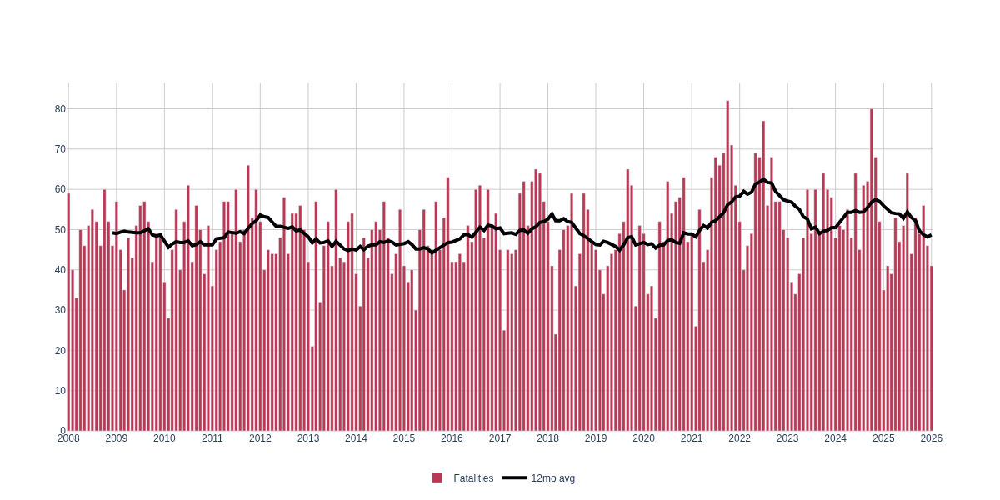
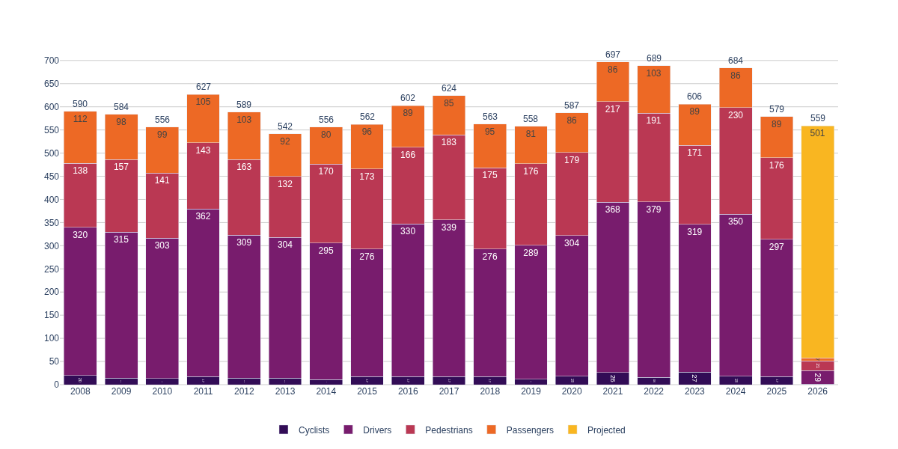
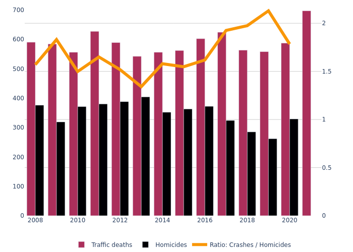

# NJ Traffic Crash Data
Analysis of [NJ State Police fatal crash data][NJSP data] (2008-present) and [NJDOT crash data][NJDOT data] (2000-2021)

- Plots: [neighbor-ryan.org/nj-crashes](https://neighbor-ryan.org/nj-crashes/)
- Hudson County map: [neighbor-ryan.org/nj-crashes/hudson/map][hudco map]

[][hudco map]

Fatal crash data updates daily (via [GitHub Action](https://github.com/neighbor-ryan/nj-crashes/actions)), plots below are current through either the most recent month or year.

### NJ traffic deaths w/ 12mo rolling avg

[](https://neighbor-ryan.org/nj-crashes/#per-month)

### 2021 and 2022 set 17-year highs for traffic deaths in NJ

[](https://neighbor-ryan.org/nj-crashes/#per-year)

(NJSP only includes victim-type data since 2020)

### In NJ, traffic deaths are 1.5x-2x homicides



([Uniform Crime Reports][UCR data] 1990-2020, [Disaster Center][Disaster Center data] 1960-2019)

#### Traffic deaths, by month


---

## Setup

This project uses [uv](https://docs.astral.sh/uv/) for Python dependency management:

```bash
# Install dependencies
uv sync

# Run scripts
uv run njsp refresh_data
uv run njdot compute db

# Or activate the virtual environment
source .venv/bin/activate
njsp refresh_data
```

## Data Management

This repository tracks two distinct crash datasets with different update patterns:

### NJSP (Daily Updates, Git-tracked)
- **Source**: [NJ State Police fatal crash XMLs][NJSP data]
- **Coverage**: Fatal crashes only, 2008-present
- **Update Frequency**: Daily (via [GitHub Action](https://github.com/neighbor-ryan/nj-crashes/actions))
- **Size**: Small (~1-2MB databases)
- **Storage**: XMLs committed to git, databases regenerated locally
- **Regenerate**:
  ```bash
  njsp refresh_data  # By default, current year and 2 preceding
  njsp update_data   # Generate parquets from XMLs
  njsp update_pqts   # Update SQLite databases
  ```

### NJDOT (Annual Updates, DVC-tracked)
- **Source**: [NJDOT crash data][NJDOT data] (zip files)
- **Coverage**: All crashes (fatal, injury, property damage), 2001-present
- **Update Frequency**: Annual
- **Size**: Large (2.4GB crashes.db, ~280MB parquets)
- **Storage**: DVC-tracked, stored in S3
- **Pipeline**: See [njdot/README.md](./njdot/README.md#new-year-pipeline)
- **Pull databases**:
  ```bash
  dvc pull www/public/njdot/crashes.db.dvc
  # Or regenerate (slow, requires geo-processing):
  env -u PYTHONPATH njdot compute pqt -f
  env -u PYTHONPATH njdot compute db -f
  ```

## Analysis
- [parse-njsp-xmls.ipynb](./parse-njsp-xmls.ipynb)
- [nj-crime-stats.ipynb](./nj-crime-stats.ipynb)
- [Hudson Crashes.ipynb](./Hudson%20Crashes.ipynb)

NJDOT crash data parsing / analysis in [njdot/](./njdot).

[NJDOT data]: https://www.state.nj.us/transportation/refdata/accident/rawdata01-current.shtm
[NJSP data]: https://nj.gov/njsp/info/fatalacc/index.shtml
[hudco map]: https://neighbor-ryan.org/nj-crashes/map/hudson/
[UCR data]: https://nj.gov/njsp/ucr/uniform-crime-reports.shtml
[Disaster Center data]: https://www.disastercenter.com/crime/njcrimn.htm
