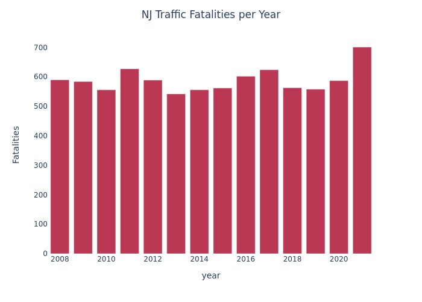

# NJ Traffic Fatality Data
Analysis of NJSP data from 2008-present: https://nj.gov/njsp/info/fatalacc/index.shtml

Same plot but with lines:

The last 6 months of 2021 were the worst months on record (since 2008).

2021 was 19% higher than 2020:

Months w/ 12mo rolling avg:

Notebook with analysis: [parse-njsp-xmls.ipynb](./parse-njsp-xmls.ipynb)
