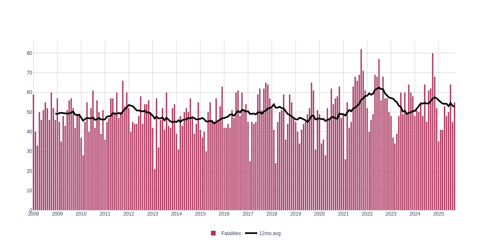
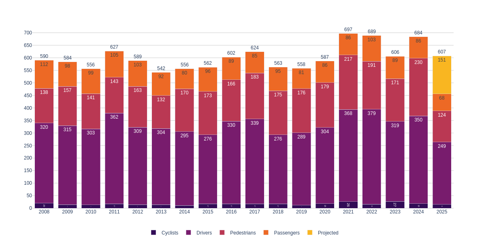
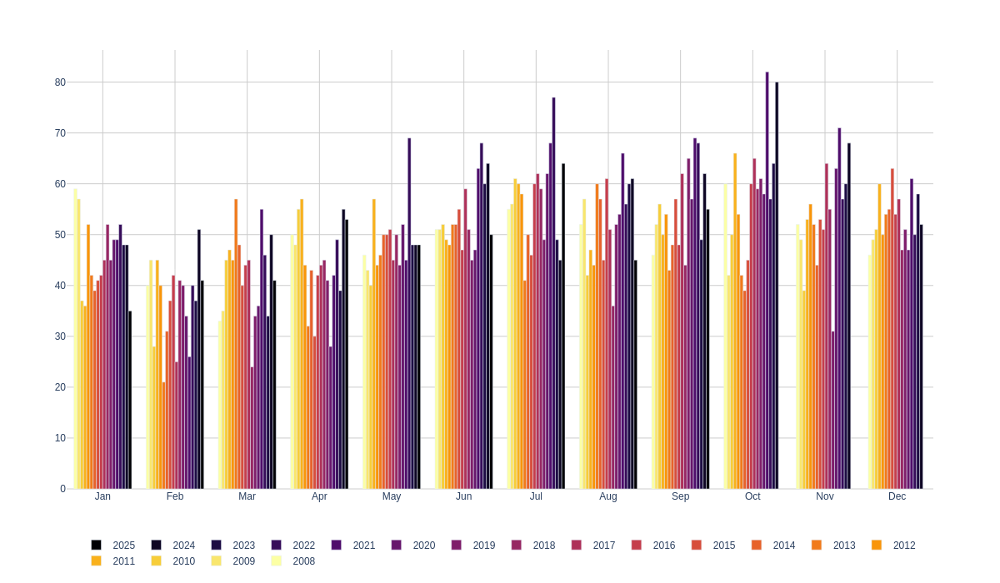
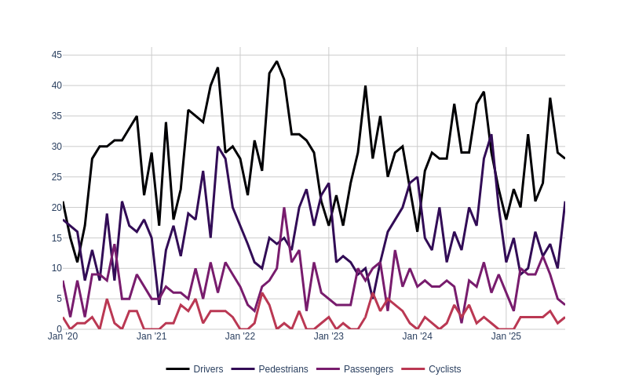

# NJ Traffic Violence Data
Analysis of NJ State Police traffic violence data (2008-present)

- Web view: [neighbor-ryan.org/nj-crashes](https://neighbor-ryan.org/nj-crashes/)
- NJSP data: [nj.gov/njsp/info/fatalacc](https://nj.gov/njsp/info/fatalacc/index.shtml)

### NJ traffic deaths w/ 12mo rolling avg

[](https://neighbor-ryan.org/nj-crashes/#per-month)

### 2021 was the worst year on record, and 2022 is on pace to exceed it

[](https://neighbor-ryan.org/nj-crashes/#per-year)

(Victim type data is only available starting since 2020, so most history is unknown)

### In NJ, traffic deaths are 1.5x-2x homicides


**Traffic deaths spiked by 19% in 2021.**

### The 9 deadliest months on record were in 2021 and 2022:

[](https://neighbor-ryan.org/nj-crashes/#by-month-bars)

### Victim types: drivers > pedestrians > passengers > cyclists

[](https://neighbor-ryan.org/nj-crashes/#per-month-type)

This data is available starting from 2020.

---

## Data / Info

### Data sources:
- New Jersey State Police
  - Traffic fatalities: [nj.gov/njsp/info/fatalacc/index.shtml](https://nj.gov/njsp/info/fatalacc/index.shtml)
  - Uniform Crime Reports: [nj.gov/njsp/ucr/uniform-crime-reports.shtml](https://nj.gov/njsp/ucr/uniform-crime-reports.shtml)
- Disaster Center: [www.disastercenter.com/crime/njcrimn.htm](https://www.disastercenter.com/crime/njcrimn.htm)

### Analysis
- [parse-njsp-xmls.ipynb](./parse-njsp-xmls.ipynb)
- [nj-crime-stats.ipynb](./nj-crime-stats.ipynb)

Refresh data:
```bash
./refresh-data.sh  # By default: 2020, 2021, and 2022
```

Execute notebook:
```bash
papermill parse-njsp-xmls.ipynb out/parse-njsp-xmls.ipynb  # Update data, plots
```

---

## Appendix

A few more plots:

#### Month groups, as bars


