# NJDOT Traffic Crash Data
Work-in-progress analysis of [NJDOT's raw traffic crash data](https://www.state.nj.us/transportation/refdata/accident/rawdata01-current.shtm).

[Injury, Property Damage, Death plots](#plots):
- [Per Month (Statewide)](#state-month)
- [Per {Month, County}](#counties-month)
- [Per Year (Statewide)](#state-year)
- [Per {Year, County}](#counties-year)
- [as Percentages of all Crashes](#pcts)

[Notes / Methods](#methods):
- [Example: Download + Clean Data](#example)
- [Caveats / TODOs](#todos)

## Plots <a id="plots"></a>
I've only done a very quick first pass at cleaning and plotting the data here, so take these with a grain of salt.

There is a marked decrease in "injury" and "property damage" crashes since the onset of COVID (≈March 2020), but fatal crashes are roughly flat:

### Injuries, Property Damage, Deaths per Month (Statewide) <a id="state-month"></a>

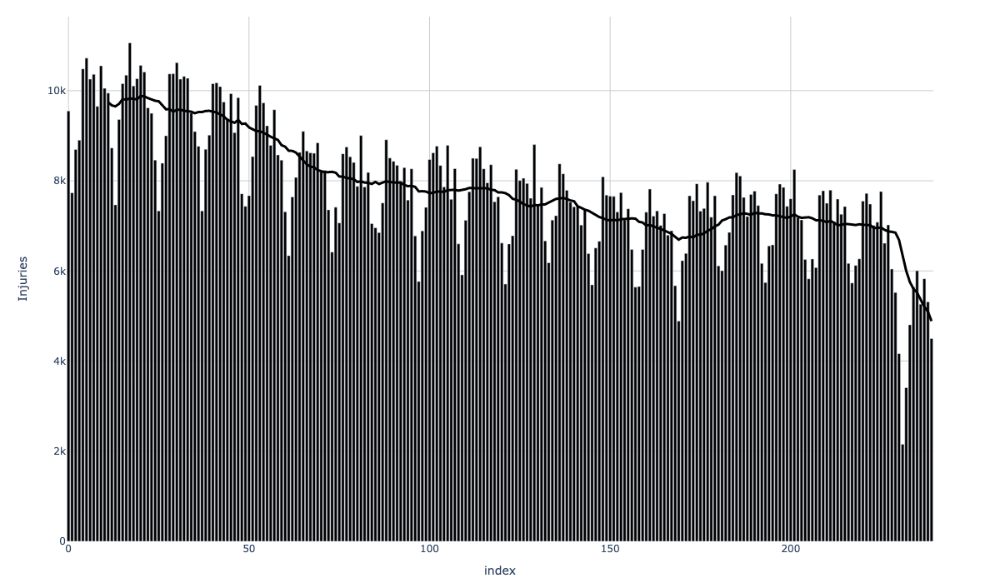


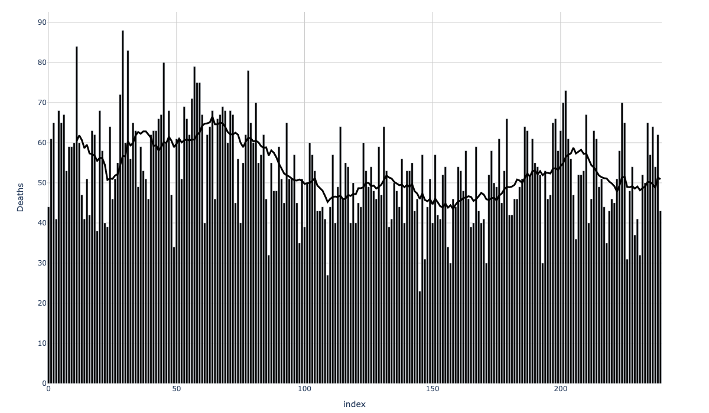

### Injuries, Property Damage, Deaths (per County x Month) <a id="counties-month"></a>

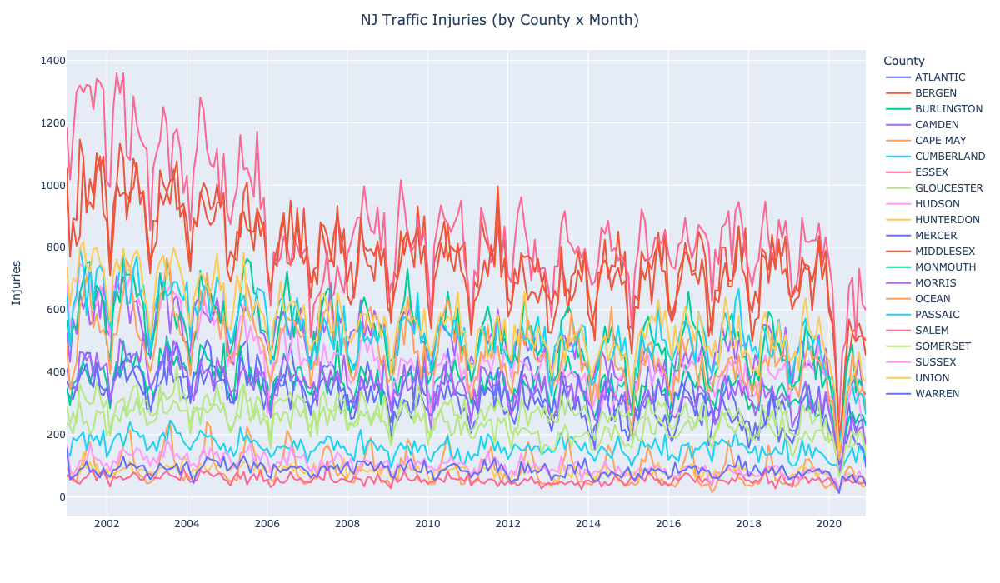


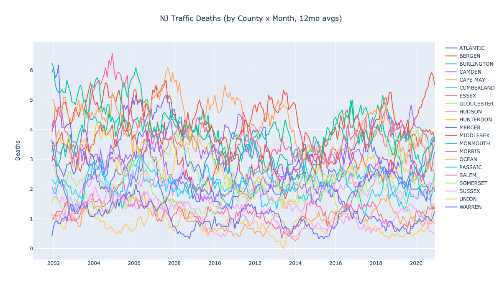

### Injuries, Property Damage, Deaths per Year (Statewide) <a id="state-year"></a>

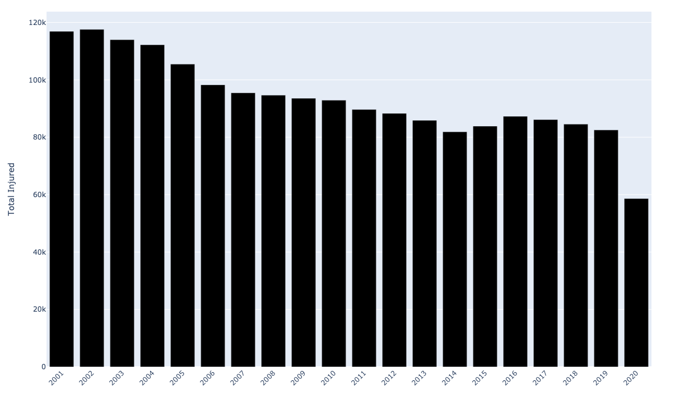

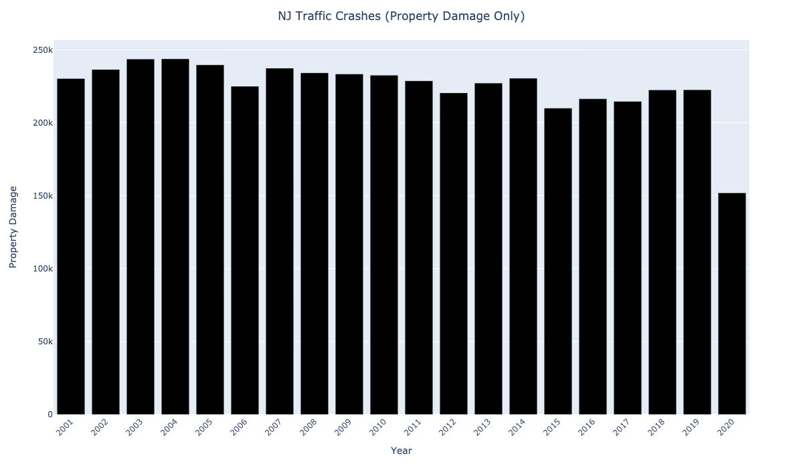

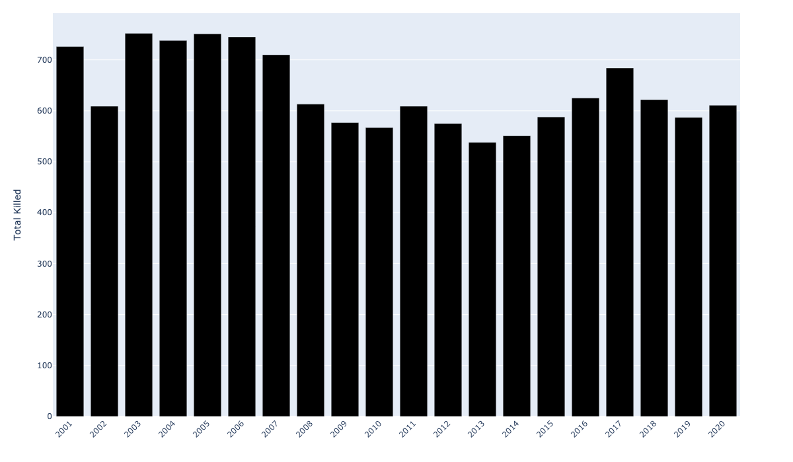

### Injuries, Property Damage, Deaths (per County x Year) <a id="counties-year"></a>

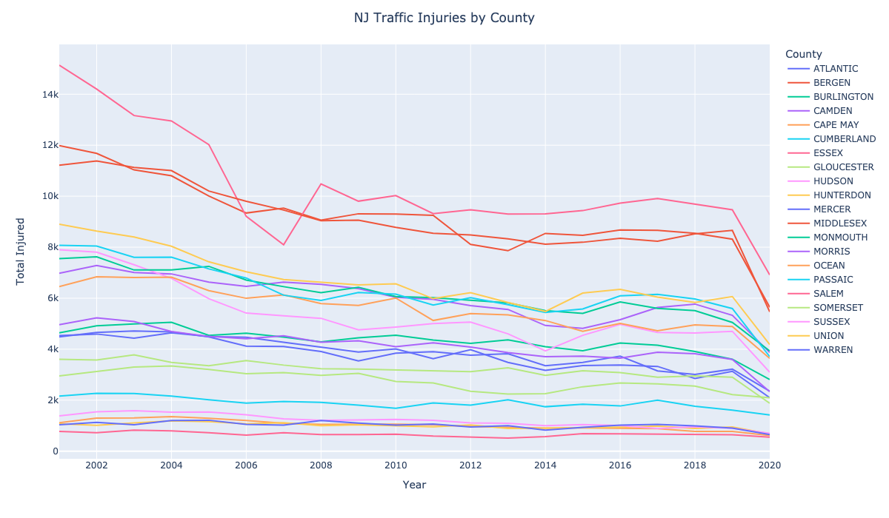

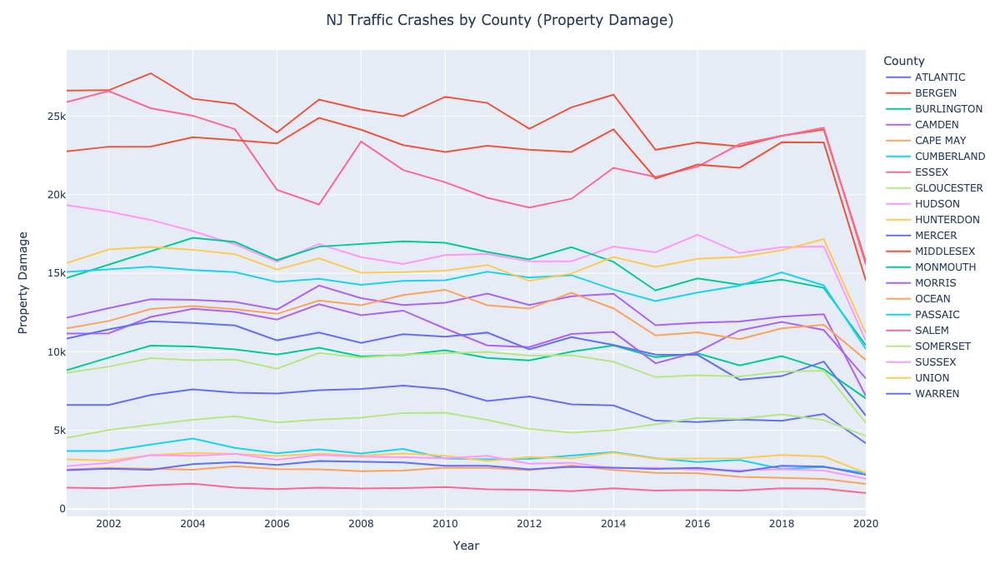

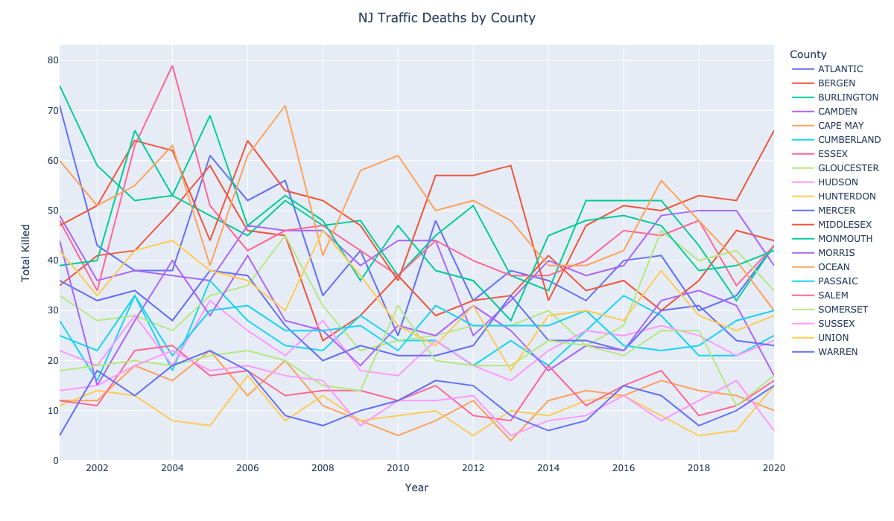

### Injuries, Property Damage, Deaths as Percentages of all Crashes <a id="pcts"></a>

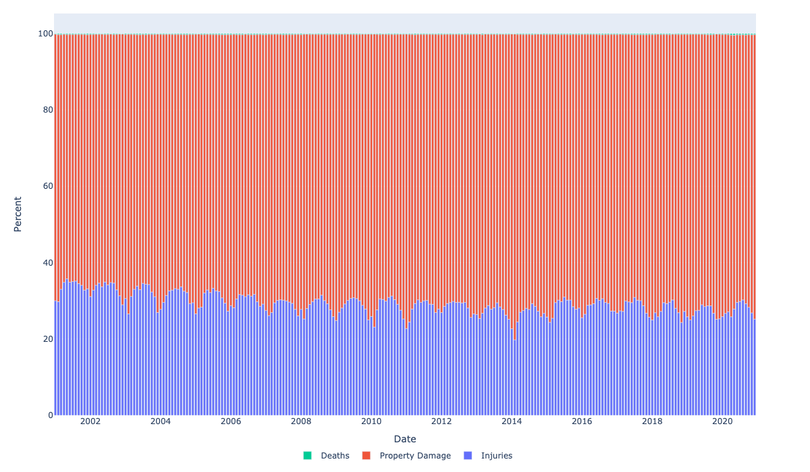


## Methods <a id="methods"></a>
[`./rawdata.py`](rawdata.py) is a CLI for downloading+caching `.zip`s, extracting `.txt`s, cleaning+converting to `.pqt` ([Parquet](https://parquet.apache.org/)).
```bash
./rawdata.py --help
# Usage: rawdata.py [OPTIONS] COMMAND [ARGS]...
# 
# Options:
#   --help  Show this message and exit.
# 
# Commands:
#   check-nj-agg      For one or more years, verify the `NewJersey` file is a
#                     concatenation of the county-specific files
#   parse-fields-pdf  Parse fields+lengths from one of the `*CrashTable.pdf`s,
#                     using Tabula
#   pqt               Convert 1 or more unzipped {year, county} `.txt` files to
#                     `.pqt`s, with some dtypes and cleanup
#   txt               Convert 1 or more {year, county} .zip files (convert each
#                     .zip to a single .txt)
#   zip               Download 1 or more {year, county} .zip file(s)
```

### Example: Download + Clean Data <a id="example"></a>
```bash
./rawdata.py zip -c NewJersey  # download statewide-aggregated `.zip`s for [2001,2020] x {Accidents,Drivers,Vehicles,Occupants}
./rawdata.py txt -c NewJersey  # Extract each `.zip` (to a single `.txt`)
./rawdata.py pqt -c NewJersey  # Clean (parse dates, assign some dtypes) + convert to Parquet
```

### Caveats / TODOs <a id="todos"></a>

The fatal crash stats here also seem to differ from NJSP's data (see [the root of this repository](..)) by ≈10%.
