# NJ DOT Car Crash Data
Analysis of [NJ DOT car crash data](https://www.state.nj.us/transportation/refdata/accident/rawdata01-current.shtm).

[**Plots**](#plots):
  - [Crashes per Month (Statewide)](#state-month)
      - [Injuries per Month (Statewide)](#state-month-injuries)
      - [Property Damage Crashes per Month (Statewide)](#state-month-crashes)
      - [Deaths per Month (Statewide)](#state-month-deaths)
  - [Crashes per {County, Month}](#counties-month)
      - [Injuries per {County, Month}](#counties-month-injuries)
      - [Property Damage Crashes per {County, Month}](#counties-month-crashes)
      - [Deaths per {County, Month}](#counties-month-deaths)
  - [Crashes per Year (Statewide)](#state-year)
      - [Injuries per Year (Statewide)](#state-year-injuries)
      - [Property Damage Crashes per Year (Statewide)](#state-year-crashes)
      - [Deaths per Year (Statewide)](#state-year-deaths)
  - [Crashes per {County, Year}](#counties-year)
      - [Injuries per {County, Year}](#counties-year-injuries)
      - [Property Damage Crashes per {County, Year}](#counties-year-crashes)
      - [Deaths per {County, Year}](#counties-year-deaths)
  - [Crash-Type Percentages](#pcts)
      - [Injuries, Property Damage, Deaths (as Percentage of All Crashes)](#pcts-all)
      - [Deaths (as Percentage of All Crashes)](#pct-deaths)

[**Methods**](#methods):
  - [New Year Data Pipeline](#new-year-pipeline) ⭐
  - [Example: Download + Clean Data](#example)
  - [Caveats / TODOs](#todos)


## Plots <a id="plots"></a>
I've only done a very quick first pass at cleaning and plotting the data here, so take these with a grain of salt.

There is a marked decrease in "injury" and "property damage" crashes since the onset of COVID (≈March 2020), but fatal crashes are roughly flat:

### Crashes per Month (Statewide) <a id="state-month"></a>

#### Injuries per Month (Statewide) <a id="state-month-injuries"></a>
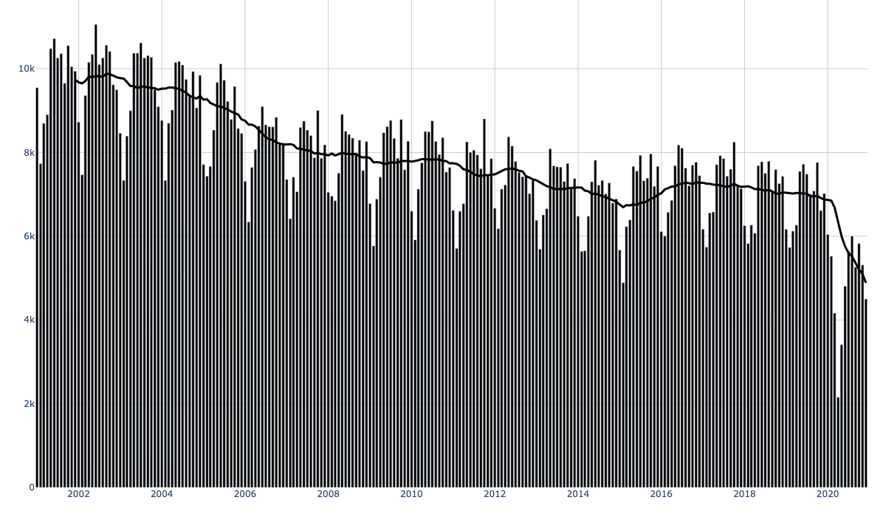

#### Property Damage Crashes per Month (Statewide) <a id="state-month-crashes"></a>
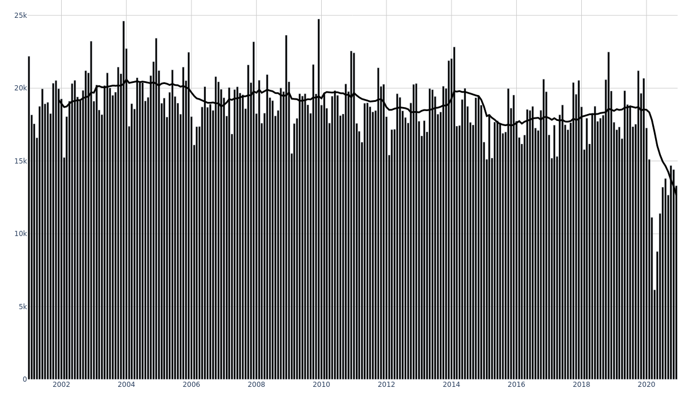

#### Deaths per Month (Statewide) <a id="state-month-deaths"></a>
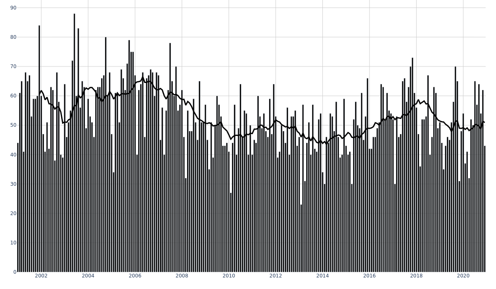

### Crashes per {County, Month} <a id="counties-month"></a>

#### Injuries per {County, Month} <a id="counties-month-injuries"></a>
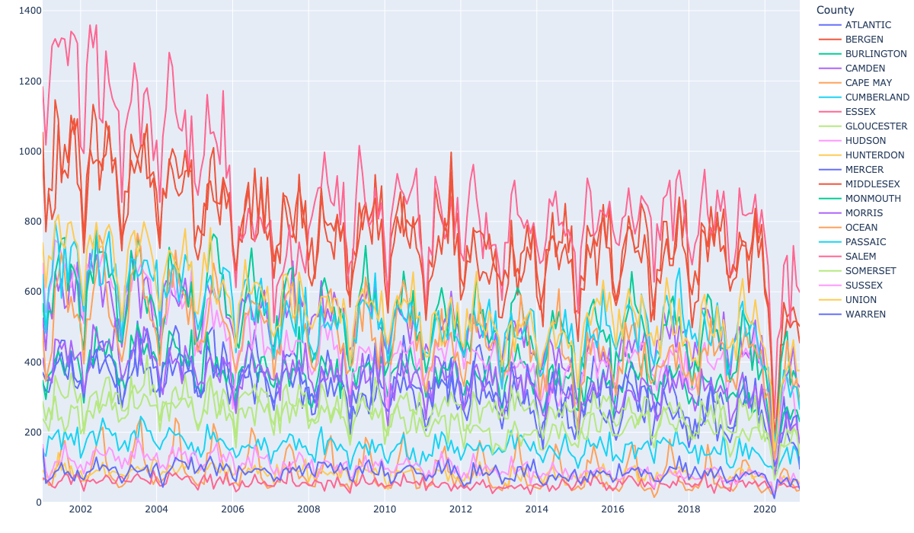

#### Property Damage Crashes per {County, Month} <a id="counties-month-crashes"></a>
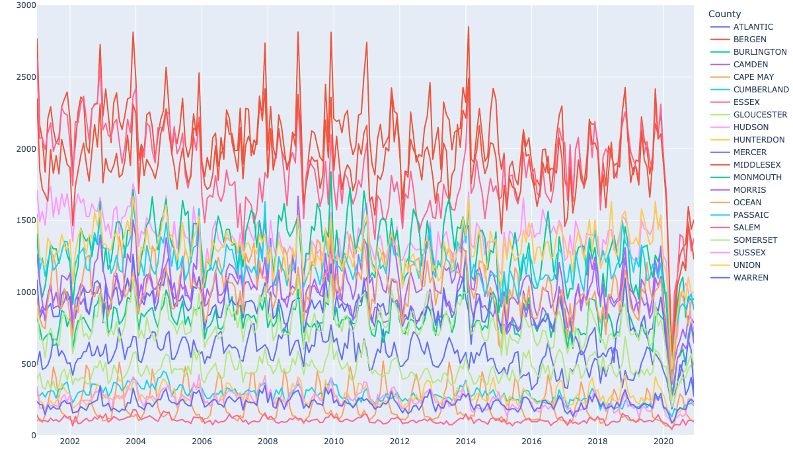

#### Deaths per {County, Month} <a id="counties-month-deaths"></a>
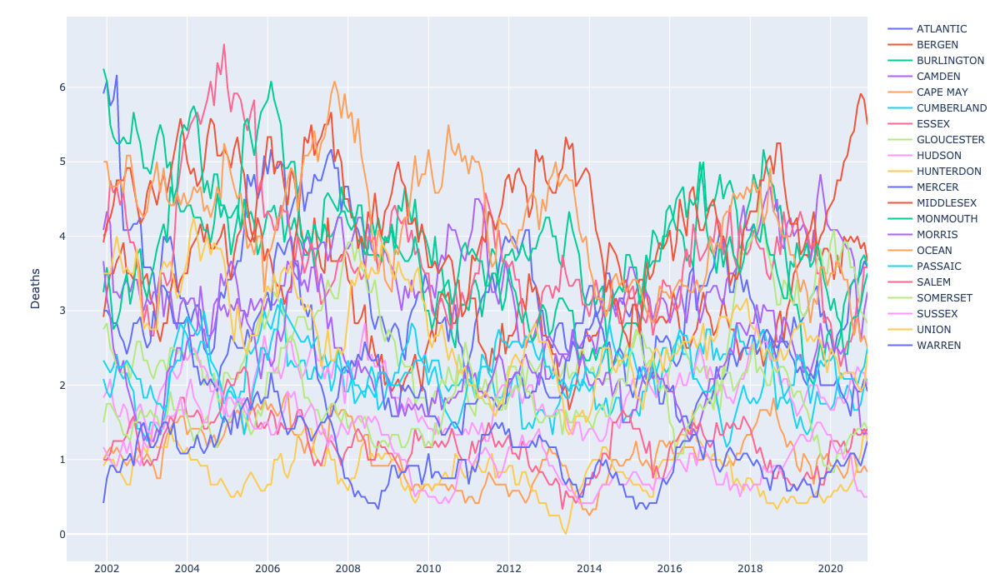

### Crashes per Year (Statewide) <a id="state-year"></a>

#### Injuries per Year (Statewide) <a id="state-year-injuries"></a>
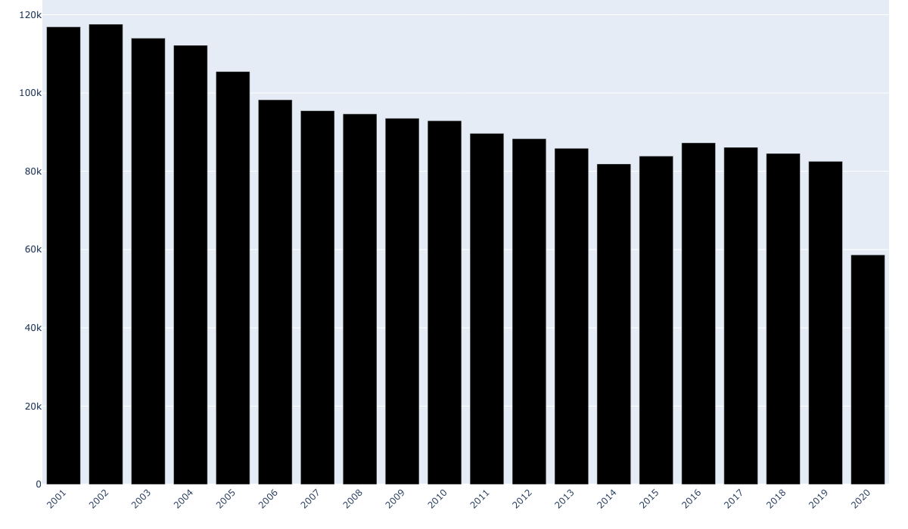

#### Property Damage Crashes per Year (Statewide) <a id="state-year-crashes"></a>
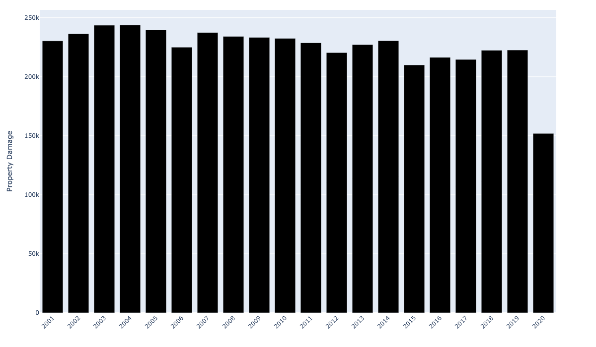

#### Deaths per Year (Statewide) <a id="state-year-deaths"></a>
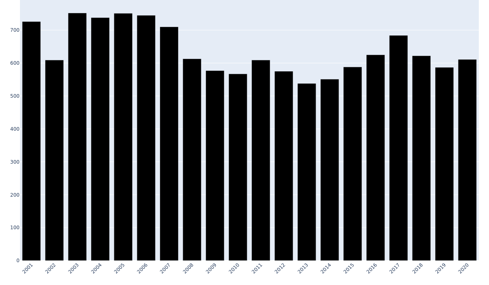

### Crashes per {County, Year} <a id="counties-year"></a>

#### Injuries per {County, Year} <a id="counties-year-injuries"></a>
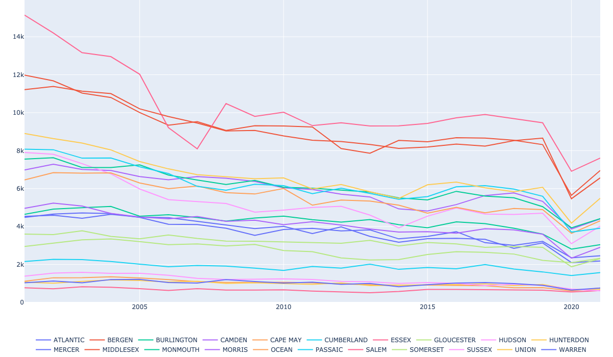

#### Property Damage Crashes per {County, Year} <a id="counties-year-crashes"></a>


#### Deaths per {County, Year} <a id="counties-year-deaths"></a>
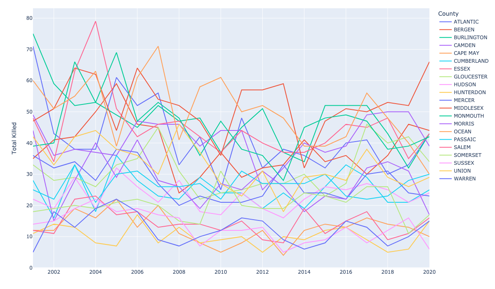

### Crash-Type Percentages <a id="pcts"></a>

#### Injuries, Property Damage, Deaths (as Percentage of All Crashes) <a id="pcts-all"></a>
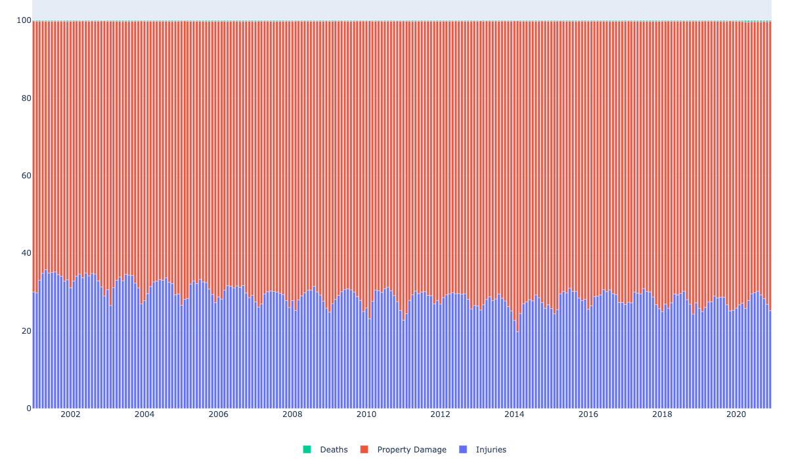

#### Deaths (as Percentage of All Crashes) <a id="pct-deaths"></a>
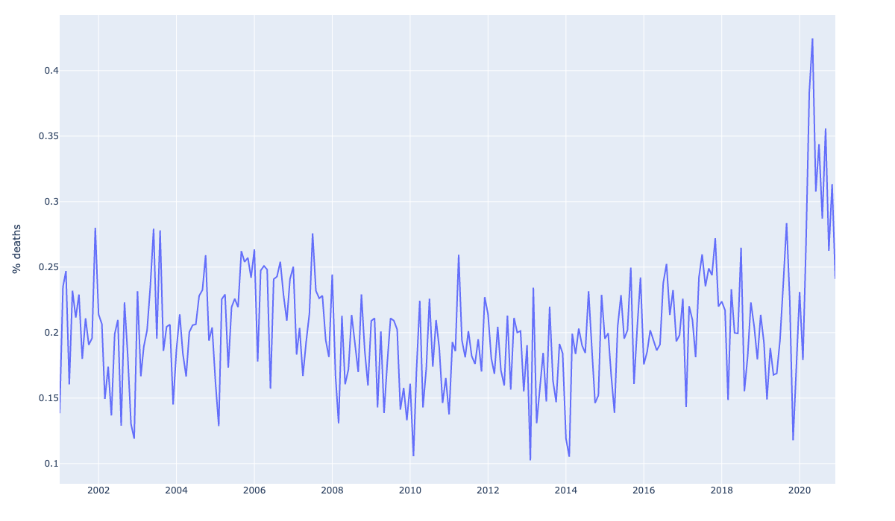

## Methods <a id="methods"></a>
[`rawdata.py`](rawdata.py) is a CLI for downloading+caching `.zip`s, extracting `.txt`s, cleaning+converting to `.pqt` ([Parquet](https://parquet.apache.org/)).
```bash
./rawdata.py --help
# Usage: rawdata.py [OPTIONS] COMMAND [ARGS]...
# 
# Options:
#   --help  Show this message and exit.
# 
# Commands:
#   check-nj-agg      For one or more years, verify the `NewJersey` file is a
#                     concatenation of the county-specific files
#   parse-fields-pdf  Parse fields+lengths from one of the `*CrashTable.pdf`s,
#                     using Tabula
#   pqt               Convert 1 or more unzipped {year, county} `.txt` files to
#                     `.pqt`s, with some dtypes and cleanup
#   txt               Convert 1 or more {year, county} .zip files (convert each
#                     .zip to a single .txt)
#   zip               Download 1 or more {year, county} .zip file(s)
```

### Example: Download + Clean Data <a id="example"></a>
```bash
./rawdata.py zip -r NewJersey  # download statewide-aggregated `.zip`s for [2001,2020] x {Accidents,Drivers,Occupants,Pedestrians,Vehicles}
./rawdata.py txt -r NewJersey  # Extract each `.zip` (to a single `.txt`)
./rawdata.py pqt -r NewJersey  # Clean (parse dates, assign some dtypes) + convert to Parquet
```

### Notebooks <a id="notebooks"></a>
- [crash-plots.ipynb](crash-plots.ipynb): load all crashes, generate plots above

### SQLite DBs
```bash
njdot compute pqt -f
njdot compute db -f
```

[cmymc.ipynb](cmymc.ipynb): generate [cmymc.db](../www/public/njdot/cmymc.db.dvc) containing several {**c**ounty, **m**uni, **y**ear, **m**onth} aggregation tables.

## New Year Data Pipeline <a id="new-year-pipeline"></a>

When new crash data is released (typically annually), follow this pipeline to process and publish it:

### 1. Download Raw Data
```bash
# Download zip files for the new year (e.g., 2023)
rawdata zip -r NJ -y 2023

# Or use last 2 digits
rawdata zip -r NJ -y 23

# Force re-download if needed
rawdata zip -r NJ -y 2023 -ff
```

The `rawdata zip` command:
- Downloads 5 record types: Accidents, Drivers, Occupants, Pedestrians, Vehicles
- Caches HTTP headers (Date, Content-Length, Last-Modified, ETag) in `njdot/data/.cache.pqt`
- Only re-downloads when headers change (除了 Date)
- Stores zips in `njdot/data/{year}/{region}{year}{type}.zip`

### 2. Extract Text Files
```bash
# Extract zip files to .txt
rawdata txt -r NJ -y 2023
```

This extracts each zip to a single `.txt` file with fixed-width comma-delimited records.

### 3. Check Schema Changes
```bash
# Check field patterns to detect schema changes
rawdata fsck fields -r NJ -y 2023

# Check specific record type
rawdata fsck fields -r NJ -y 2023 -t Vehicles
```

**Common schema changes:**
- Field width changes (e.g., 2023 Vehicles: Model field expanded from 20→30 chars)
- New fields added or removed (e.g., 2023 Vehicles: HazMat Placard removed)
- Value changes (e.g., 2023: Hit & Run blank→'N' instead of always blank)

If schema changes are detected:
1. Update `njdot/rawdata/fixes.py` with appropriate fix functions
2. Apply fixes in `rawdata pqt` step via `get_fixes()` in `pqt.py`

#### 2023 Data Quality Issues

The 2023 NJDOT data had several data quality regressions not present in prior years (2001-2022):

1. **Empty municipality names** (16 records):
   - Records had valid county/municipality codes but blank municipality names
   - **Fix**: Geocoded using lat/lon coordinates via spatial join with NJGIN municipality boundaries
   - **Location**: `njdot/rawdata/pqt.py` (applied during parquet generation)

2. **County name conflicts** (5 records):
   - Records with correct county code but wrong county name (e.g., cc=3 Burlington with cn="Middlesex")
   - **Fix**: Majority voting - use most common county name for each county code
   - **Location**: `njdot/harmonize-muni-codes.ipynb` cell [6]

3. **Municipality name typos** (2 records):
   - cc=3, mc=24: "Mount Laurel Twp" (1 record) vs. "Mount Holly Twp" (382 records)
   - **Fix**: Majority voting - use most common municipality name for each (cc, mc, year) tuple
   - **Location**: `njdot/harmonize-muni-codes.ipynb` cell [8]

4. **Type suffix variations**:
   - Raw data contains both "Township"/"Twp" and "Borough"/"Boro" variations
   - Previously caused noisy "conflicts" (10 in 2023: Deptford Township/Twp, Washington Township/Twp, etc.)
   - **Fix**: Normalize "Township"→"Twp", "Borough"→"Boro" before conflict detection
   - **Location**: `njdot/harmonize-muni-codes.ipynb` cell [2]

5. **Decimal formatting in integer fields** (69,536 Accident records):
   - "Distance To Cross Street" field has trailing decimals: `'50.0'`, `'0.00'`, `'25.0'`, etc.
   - Pattern: Values 0-99 formatted with decimals (e.g., `'50.0'`, `'0.00'`); larger values sometimes have trailing `.` (e.g., `'100.'`, `'135.'`)
   - 99.996% are whole numbers (69,533); only 3 have fractional parts (`0.5` twice, `2.7` once)
   - This field had NO decimals in 2001-2022 data (always formatted as `'50'`, `'100'`, etc.)
   - **Fix**: Targeted decimal-stripping for this specific field only
     - Verifies fractional value histogram matches expected `{0.5: 2, 2.7: 1}` (warns if unexpected values found)
     - Strips trailing decimals (`.d*`) and truncates the 3 fractional values to integers
   - **Location**: `njdot/load.py:load_year_df()` (lines 99-130)

**Architecture**: Structural data issues (empty names) are fixed during parquet generation in `pqt.py`. Name conflicts and typos are resolved via majority voting in the `harmonize-muni-codes.ipynb` notebook, which previously asserted zero conflicts but now handles them gracefully. Decimal formatting issues are handled during integer type conversion in `load.py`.

### 4. Generate Per-Year Parquet Files
```bash
# Generate .pqt files for the new year
rawdata pqt -r NJ -y 2023

# Force regeneration if needed
rawdata pqt -r NJ -y 2023 -f
```

This creates:
- `njdot/data/{year}/{region}{year}{type}.pqt`
- Applies schema fixes, type conversions, and cleanup
- Files are typically 10-50MB each

Verify the parquets:
```bash
python3 -c "import pandas as pd; df = pd.read_parquet('njdot/data/2023/NewJersey2023Accidents.pqt'); print(f'Rows: {len(df)}')"
```

### 5. Generate Combined Parquet Files
```bash
# Generate combined parquets across all years
env -u PYTHONPATH njdot compute pqt -f
```

**Note:** Run with `env -u PYTHONPATH` to avoid shadowing PyGithub package.

This performs geo-processing for crashes:
1. **Original location geocoding** (`olat/olon` → `occ/omc`):
   - Creates GeoDataFrame from crash report lat/lon
   - Spatial join with NJ municipality geometries → original county/muni codes

2. **Interpolated location geocoding** (`sri/mp` → `ilat/ilon` → `icc/imc`):
   - Uses SRI (Standard Route Identifier) + milepost data
   - Geocodes to lat/lon via `nj_sri_mp.db` (download from S3 if missing)
   - Spatial join with NJ municipality geometries → interpolated county/muni codes

3. **Deduplication**: Resolves duplicate spatial join results using original `cc/mc` from crash record

Outputs combined parquets in `njdot/data/`:
- `crashes.parquet` (~280MB, includes geo-processing)
- `drivers.parquet` (~200MB)
- `occupants.parquet` (~200MB)
- `pedestrians.parquet` (~5MB)
- `vehicles.parquet` (~240MB)

### 6. Generate SQLite Databases
```bash
# Generate SQLite databases for web app
env -u PYTHONPATH njdot compute db -f
```

This reads the combined parquets and creates indexed SQLite databases in `www/public/njdot/`:
- `crashes.db` (~2.4GB)
- `drivers.db` (~1GB)
- `occupants.db` (~876MB)
- `pedestrians.db` (~19MB)
- `vehicles.db` (~1.1GB)

Indexes are created for common query patterns (e.g., `(severity, dt, cc, mc)` for crashes).

### 7. Track with DVC
```bash
# DVC automatically adds .dvc files during compute db
# Commit the changes
git add njdot/data/2023/*.pqt.dvc
git add njdot/data/*.parquet.dvc
git add www/public/njdot/*.db.dvc
git commit -m "Add 2023 NJDOT crash data"
```

### 8. Upload to S3
```bash
# Databases are automatically uploaded during compute db
# Manually upload if needed:
dvc push
```

### 9. Verify Web App
```bash
# Start dev server
cd www
npm run dev
```

Visit `http://localhost:3000/#njdot` and verify:
- New year appears in year selector
- Crash counts match expected values
- Maps render correctly

### Dependencies

**SRI Database** (`nj_sri_mp.db`): Required for milepost geocoding in step 5. Download from S3 if missing:
```bash
aws s3 cp s3://nj-crashes/nj_sri_mp.db nj_sri_mp.db
```

To regenerate or update SRI data:
```bash
# Fetch SRI data for all counties (slow, rate-limited)
nj-crashes sri county all fetch-sris --max-num -1
```

**Municipality Geometries**: Automatically pulled by DVC when needed. Located at `nj_crashes/munis.geojson`.

### Troubleshooting

**HTTP header caching issues**: If `rawdata zip` isn't downloading updated files, check `.cache.pqt` for stale entries. Can force with `-ff` flag.

**UTF-8 decode errors**: Raw crash data contains invalid UTF-8 sequences. Use `LC_ALL=C` for text processing tools (`trim`, `col`, etc.).

**Schema changes**: Run `rawdata fsck fields` to detect. Add fixes to `njdot/rawdata/fixes.py` and update `get_fixes()` mapping.

**Geo-processing errors**: Ensure `nj_sri_mp.db` exists and municipality geometries are available. Check for geopandas version compatibility (spatial join column names changed in recent versions).

**Missing 2023 data in DB**: Check that combined parquet includes 2023 (step 5) before building DB (step 6). Delete cached parquets to force regeneration.

### Caveats / TODOs <a id="todos"></a>

The fatal crash stats here also seem to differ from NJSP's data (see [the root of this repository](..)) by ≈10%.

---

### Attributions:
- [Driver](https://thenounproject.com/icon/driver-1847797/) by Musmellow from <a href="https://thenounproject.com/browse/icons/term/driver/" target="_blank" title="Driver Icons">Noun Project</a> (CC BY 3.0)
- [Passenger](https://thenounproject.com/icon/passenger-4353992/) by Luiz Carvalho from <a href="https://thenounproject.com/browse/icons/term/passenger/" target="_blank" title="passenger Icons">Noun Project</a> (CC BY 3.0)
- [Pedestrian](https://thenounproject.com/icon/pedestrian-1826968/) by Adrien Coquet from <a href="https://thenounproject.com/browse/icons/term/pedestrian/" target="_blank" title="Pedestrian Icons">Noun Project</a> (CC BY 3.0)
- [Bicycle](https://thenounproject.com/icon/bicycle-1311416/) by Adrien Coquet from <a href="https://thenounproject.com/browse/icons/term/bicycle/" target="_blank" title="Bicycle Icons">Noun Project</a> (CC BY 3.0)
- [Car](https://thenounproject.com/icon/car-6583503/) by Nur syifa fauziah from <a href="https://thenounproject.com/browse/icons/term/car/" target="_blank" title="Car Icons">Noun Project</a> (CC BY 3.0)
- [Person](https://thenounproject.com/icon/person-6627610/) by Rini Bahtiar from <a href="https://thenounproject.com/browse/icons/term/person/" target="_blank" title="person Icons">Noun Project</a> (CC BY 3.0)

**TODO:** add to www pages
