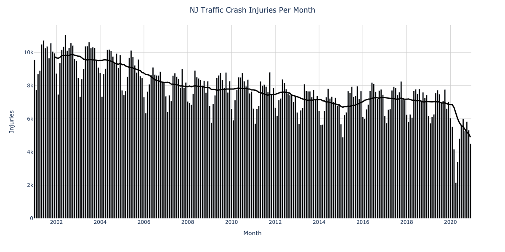
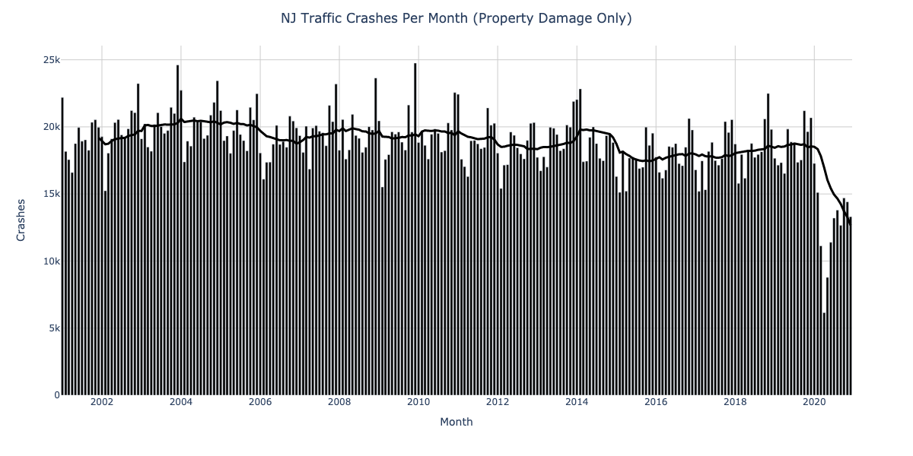
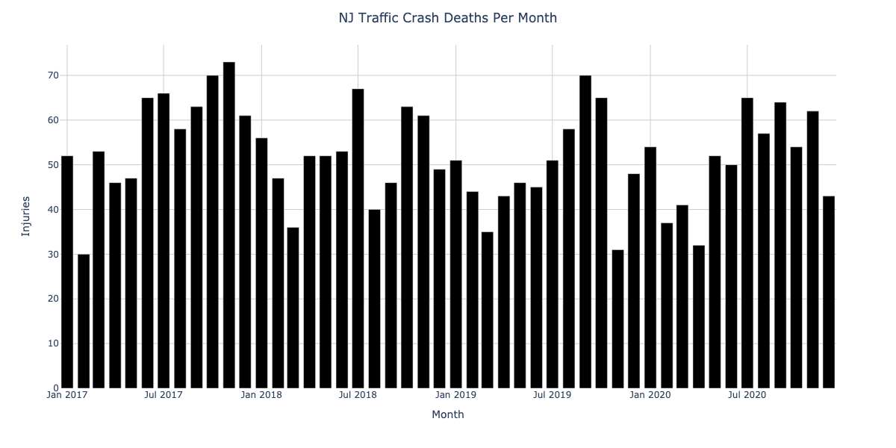

# NJDOT Traffic Crash Data
Work-in-progress analysis of [NJDOT's raw traffic crash data](https://www.state.nj.us/transportation/refdata/accident/rawdata01-current.shtm)

I've only done a very quick first pass at cleaning and plotting the data here, so take these with a grain of salt.

There is a marked decrease in "injury" and "property damage" crashes since the onset of COVID (≈March 2020), but fatal crashes are roughly flat:

The fatal crash stats here also seem to differ from NJSP's data (see [the root of this repository](..)) by ≈10%.
